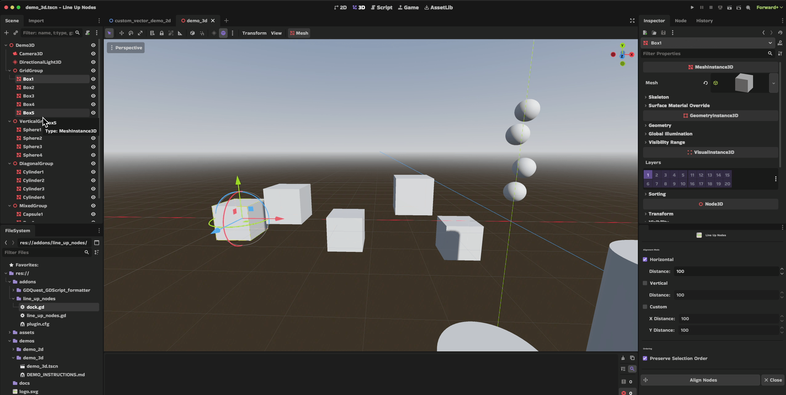

# Line Up Nodes - Godot Editor Plugin

A Godot 4.5 editor plugin that provides a convenient dock panel for aligning selected nodes into straight lines at fixed distances.


## Features

- **Three Alignment Modes**
  - **Horizontal**: Align nodes along the X axis with configurable spacing
  - **Vertical**: Align nodes along the Y axis with configurable spacing
  - **Custom**: Align nodes using custom X and Y offset vectors

- **Flexible Ordering**
  - Preserve selection order: Maintains the order in which nodes were selected
  - Auto-sort by position: Automatically orders nodes based on their current position along the alignment axis

- **Editor Integration**
  - Full Undo/Redo support
  - Works seamlessly with Godot's editor selection system
  - Persistent dock panel that integrates into the editor UI

- **Node Type Support**
  - Node2D nodes (uses `position` property)
  - Node3D nodes (uses `global_position` property)

## Installation

### Via Asset Library (Recommended)

1. Open your Godot project
2. Go to **AssetLib** tab at the top of the editor
3. Search for "Line Up Nodes"
4. Click **Download** then **Install**
5. Enable the plugin:
   - Go to **Project → Project Settings → Plugins**
   - Find "Line Up Nodes" in the list
   - Check the "Enable" checkbox

### Manual Installation

1. Download or clone this repository
2. Copy the `addons/line_up_nodes` folder into your Godot project's `addons` directory
3. Enable the plugin:
   - Go to **Project → Project Settings → Plugins**
   - Find "Line Up Nodes" in the list
   - Check the "Enable" checkbox

## Usage

### Basic Workflow

1. Select at least 2 nodes in your scene (Node2D or Node3D)
2. Open the "Line Up Nodes" dock panel (should appear in the left dock area by default)
3. Choose your alignment mode:
   - **Horizontal**: Nodes will be spaced along the X axis
   - **Vertical**: Nodes will be spaced along the Y axis
   - **Custom**: Nodes will be offset by both X and Y distances
4. Set the distance value(s) for your chosen mode
5. Optionally toggle "Preserve Selection Order" based on your needs
6. Click **Align Nodes**

### Alignment Modes Explained

#### Horizontal Mode
Aligns nodes in a horizontal line. Each node is positioned at a fixed X distance from the previous node, while maintaining the anchor node's Y position.

**Example**: Distance = 100
- Node 1 (anchor): position remains unchanged
- Node 2: anchor.x + 100, anchor.y
- Node 3: anchor.x + 200, anchor.y
- Node 4: anchor.x + 300, anchor.y

#### Vertical Mode
Aligns nodes in a vertical line. Each node is positioned at a fixed Y distance from the previous node, while maintaining the anchor node's X position.

**Example**: Distance = 50
- Node 1 (anchor): position remains unchanged
- Node 2: anchor.x, anchor.y + 50
- Node 3: anchor.x, anchor.y + 100
- Node 4: anchor.x, anchor.y + 150

#### Custom Mode
Aligns nodes using both X and Y offsets, allowing diagonal or arbitrary direction alignment.

**Example**: X Distance = 80, Y Distance = 40
- Node 1 (anchor): position remains unchanged
- Node 2: anchor.x + 80, anchor.y + 40
- Node 3: anchor.x + 160, anchor.y + 80
- Node 4: anchor.x + 240, anchor.y + 120

### Selection Order

**Preserve Selection Order (Enabled)**
Nodes are aligned in the exact order they were selected. The first node selected becomes the anchor point.

**Preserve Selection Order (Disabled)**
Nodes are automatically sorted by their current position:
- Horizontal mode: sorted by X coordinate (left to right)
- Vertical mode: sorted by Y coordinate (top to bottom)
- Custom mode: sorted by projection onto the offset direction vector

### Anchor Node

The **first node** in the list (either selection order or sorted order) serves as the anchor:
- Its position is **never modified**
- All other nodes are positioned relative to this anchor
- Each subsequent node receives a cumulative offset from the anchor

## Technical Details

### File Structure

```
addons/line_up_nodes/
├── plugin.cfg                    # Plugin configuration
├── line_up_nodes_plugin.gd      # Main EditorPlugin class
└── line_up_nodes_dock.gd        # Dock panel UI and alignment logic
```

### Requirements

- Godot Engine 4.5 or later
- GDScript 4.5

### Node Type Handling

**Node2D**
- Uses the `position` property (local position)
- Offset is applied directly to position values

**Node3D**
- Uses the `global_position` property
- X and Y offsets are applied to the global position
- Z coordinate remains unchanged during alignment

### Undo/Redo Support

All alignment operations are fully integrated with Godot's UndoRedo system:
- Each alignment creates a single undo action
- Undo restores all affected nodes to their original positions
- Redo reapplies the alignment

## Common Use Cases

- **UI Layout**: Quickly space out UI elements at consistent intervals
- **Level Design**: Align platform nodes, enemy spawn points, or collectibles
- **Prototyping**: Rapidly create evenly-spaced test objects
- **Grid Creation**: Use horizontal + vertical alignment to create grid patterns
- **Diagonal Patterns**: Use custom mode for angled alignments

## Troubleshooting

**"At least 2 nodes must be selected" error**
- Make sure you have selected 2 or more nodes in the scene tree

**"At least 2 Node2D or Node3D nodes must be selected" error**
- The plugin only works with nodes that have positional data
- Ensure your selection includes Node2D or Node3D nodes (or their derived types)

**Nodes aren't aligning as expected**
- Check that you're using the correct alignment mode
- Verify your distance values
- Try toggling "Preserve Selection Order" to change the ordering behavior

**Dock panel disappeared**
- The plugin might have been disabled
- Re-enable it in Project Settings → Plugins
- If the dock was closed via the Close button, disable and re-enable the plugin




## License

This plugin is released under the MIT License.

## Version History

**0.1.0**
- Initial release
- Three alignment modes (Horizontal, Vertical, Custom)
- Selection order preservation
- Full undo/redo support
- Node2D and Node3D support
